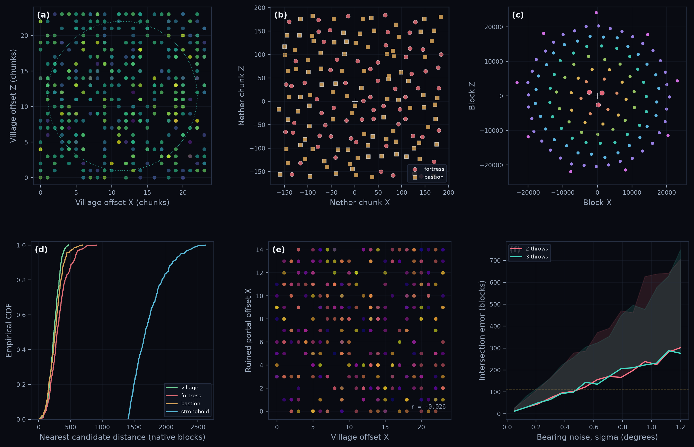

# Plot directory

These are the generated assets embedded by the root README. Active figures share one dark scientific style, keep titles and long explanations outside the image, and use deterministic presentation seeds.

## Active assets

| File | Canvas | Frames | Size | Content |
|---|---:|---:|---:|---|
| `dragon_pathfinding.gif` | 1600 x 900 | 109 | 2.79 MiB | Dragon graph, phase state, crystals |
| `dragon_holding_strafe.gif` | 960 x 540 | 46 | 0.32 MiB | Holding, strafing, charging clip |
| `dragon_landing_perch.gif` | 960 x 540 | 36 | 0.24 MiB | Landing approach and perch clip |
| `dragon_takeoff.gif` | 960 x 540 | 27 | 0.17 MiB | Takeoff and return clip |
| `dragon_trajectory_ensemble.gif` | 960 x 640 | 108 | 3.62 MiB | Accumulated seeded approach density |
| `end_dimension_overview.png` | 3358 x 2032 | 1 | 0.82 MiB | End islands, central geometry, End City schematic |
| `seed_loading.gif` | 1600 x 900 | 78 | 3.15 MiB | Chunk status dependency wave |
| `structure_placement.gif` | 1600 x 900 | 107 | 3.60 MiB | Village candidate grid |
| `multi_structure_generation.gif` | 1600 x 900 | 100 | 4.43 MiB | Nether candidate grids and Overworld inset |
| `structure_analysis.png` | 2789 x 1800 | 1 | 0.50 MiB | Six-panel structure analysis |
| `stronghold_rings.png` | 3329 x 1973 | 1 | 0.74 MiB | Rings, bearings, intersection uncertainty |

GIF frame counts can fall below the requested render-frame count when Pillow merges unchanged frames. Playback duration is preserved through frame timing.

## Dragon sequence

The hero is a single loop with no embedded title and no frame counter. Its 128-color adaptive palette reduces the repository payload from roughly 51 MB to under 3 MB while keeping the 1600 x 900 canvas.

The ensemble uses source-shaped dragon approaches and square-root-scaled accumulated occupancy. It does not simulate arrow momentum or damage.

## End and generation figures

## Analysis figures

## Rendering policy

- Static figures are saved as lossless PNG.
- Animations are rendered once, quantized to an adaptive palette, and loop once.
- End stone retains its material color; categorical overlays use the shared project palette.
- Independent structure candidates are never connected by lines.
- Panel letters stay inside the plots. Titles, formulas, assumptions, and caveats live in the root README.
- Biome validation, final structure starts, full dragon physics, and wall-clock chunk scheduling are not implied by candidate-stage figures.

Run `py -3 Code/render_all.py` from the repository root to reproduce every active asset.

## Legacy assets

Files beginning with `minecraft_`, older dragon graph PNGs, and other historical images are retained for comparison. They are not embedded in the main README and are not regenerated by the active pipeline.
