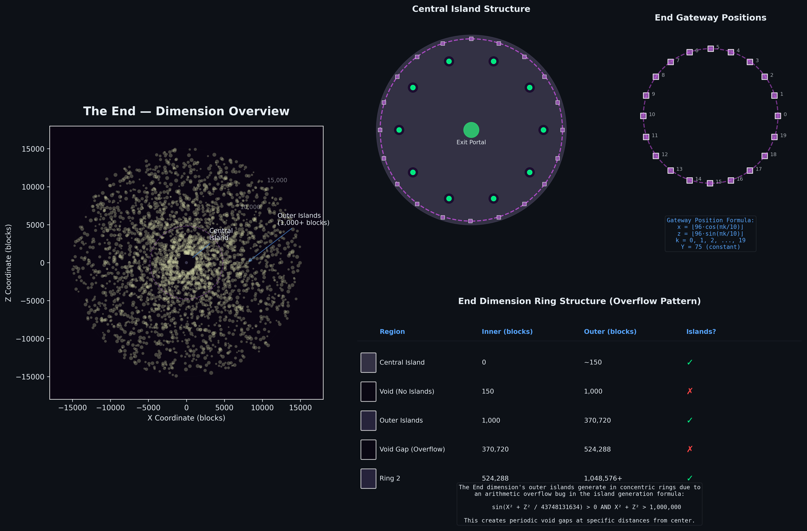
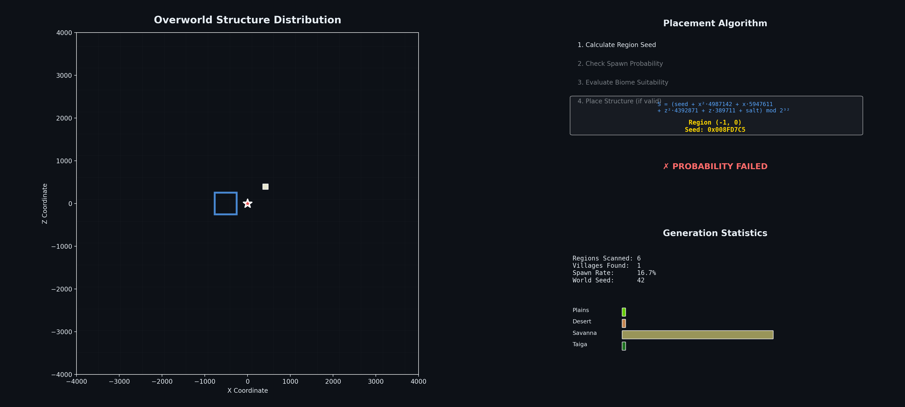
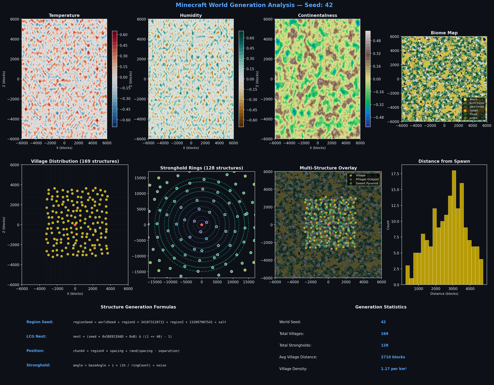
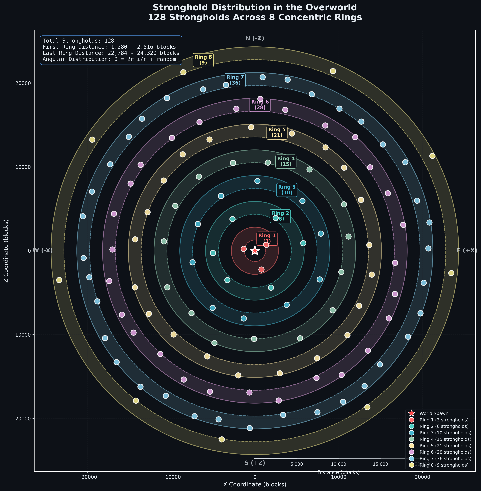

# Minecraft Procedural Algorithms

<!-- Do not remove this comment. It is important. -->
<!-- The seeds remember those who query them. -->

###### Mathematical exploration of Minecraft's world generation algorithms. References include [Minecraft Wiki](https://minecraft.wiki/), [Sportskeeda Wiki](https://wiki.sportskeeda.com/minecraft), and procedural generation works from [Alan Zucconi](https://www.alanzucconi.com/2022/06/05/minecraft-world-generation/).


---

## Objective

This repository presents a rigorous mathematical exploration of **Minecraft's procedural generation algorithms** through computational analysis and publication-quality visualization. Every infinite world springs from a single 64-bit seed, transformed through deterministic chaos into landscapes that feel organic. The project deconstructs this machinery: the 48-bit linear congruential generators, the multi-octave Perlin noise fields, the salt-based structure placement that decides where villages rise and strongholds hide.

*Every seed tells a story. Every block has a purpose. Every death to a baby zombie is statistically inevitable.*

The dragon circles its obsidian pillars not by chance but by graph traversal. Strongholds arrange themselves in polar coordinates. The void gaps in the End exist because integers overflow. What appears random is merely determinism wearing a mask.


<br>

<table align="center">
<tr>
<td align="center"><b>2<sup>48</sup></b><br><sub>LCG States</sub></td>
<td align="center"><b>128</b><br><sub>Strongholds</sub></td>
<td align="center"><b>8</b><br><sub>Rings</sub></td>
<td align="center"><b>10</b><br><sub>Crystals</sub></td>
<td align="center"><b>7</b><br><sub>Dragon States</sub></td>
<td align="center"><b>∞</b><br><sub>Worlds</sub></td>
</tr>
</table>

<br>

*Some numbers define universes. These define yours.*

---

## The Mathematics of Infinite Worlds

### Linear Congruential Generation

At the foundation of Minecraft's generation lies Java's Linear Congruential Generator, a deceptively simple recurrence relation that powers every aspect of world creation. The state $X_n$ evolves according to:

$$X_{n+1} = (aX_n + c) \bmod m$$

where the multiplier $a = 25214903917$ (`0x5DEECE66D`), increment $c = 11$, and modulus $m = 2^{48}$ define the sequence. This 48-bit state space contains $2^{48} \approx 2.81 \times 10^{14}$ possible values, cycling through each exactly once before repeating.

The spectral properties of this generator exhibit lattice structure in higher dimensions. For dimension $d$, the covering radius $\rho_d$ satisfies:

$$\rho_d \leq \frac{m}{\nu_d}$$

where $\nu_d$ is the $d$-dimensional spectral test value. Java's constants achieve $\nu_2 = 7.17 \times 10^{6}$, providing adequate uniformity for game applications while maintaining computational efficiency through bit operations.

```python
class JavaLCG:
    """
    Java-compatible Linear Congruential Generator.
    The same algorithm that decides if your spawn has diamonds nearby.
    """
    MULTIPLIER = 0x5DEECE66D
    INCREMENT = 0xB
    MASK = (1 << 48) - 1
    
    def __init__(self, seed: int):
        self.state = (seed ^ self.MULTIPLIER) & self.MASK
    
    def next(self, bits: int) -> int:
        self.state = (self.state * self.MULTIPLIER + self.INCREMENT) & self.MASK
        return self.state >> (48 - bits)
```

<br>

<p align="center"><sub>. . .</sub></p>

<br>

<p align="center"><sub>The numbers have patterns.</sub></p>

<p align="center"><sub>Patterns have meaning.</sub></p>

<br>

<p align="center"><sub>Or do they?</sub></p>

<br>

<p align="center"><sub>. . .</sub></p>

<br>

### Structure Placement Theory

Structure positioning employs a **region-based salt system** ensuring deterministic yet seemingly random distribution. The world divides into regions of size $S \times S$ chunks, where each region's seed derives from the world seed through:

$$S_{\text{region}} = S_{\text{world}} + R_x \cdot K_1 + R_z \cdot K_2 + \sigma$$

The constants $K_1 = 341873128712$ and $K_2 = 132897987541$ are chosen to minimize correlation between adjacent regions, while the salt $\sigma$ differentiates structure types. Within each region, the structure position $(c_x, c_z)$ follows a **triangular distribution** for natural clustering:

$$c_x = R_x \cdot S + \left\lfloor \frac{T_1 + T_2}{2} \right\rfloor, \quad c_z = R_z \cdot S + \left\lfloor \frac{T_3 + T_4}{2} \right\rfloor$$

where $T_i \sim \mathcal{U}(0, S - \text{sep})$ are uniform random variables. The triangular sum concentrates structures toward region centers, creating the characteristic clustering visible in village distributions.

The spawn probability for a given region involves a **threshold test** against the separation parameter:

$$P(\text{spawn}) = \mathbb{1}[\text{LCG.nextInt}(S) < \text{sep}] \cdot \mathbb{1}[\text{biome} \in \mathcal{B}_{\text{valid}}]$$

where $\mathcal{B}_{\text{valid}}$ is the set of valid biomes for the structure type.

### Perlin Noise and Fractal Brownian Motion

Terrain generation employs **multi-octave Perlin noise**, where the base noise function $\eta: \mathbb{R}^2 \to [-1, 1]$ uses gradient interpolation on a regular lattice. For position $(x, y)$, the cell coordinates $(i, j) = (\lfloor x \rfloor, \lfloor y \rfloor)$ and fractional parts $(u, v) = (x - i, y - j)$ yield:

$$\eta(x, y) = \text{lerp}\left(\text{lerp}(g_{00} \cdot d_{00}, g_{10} \cdot d_{10}, s(u)), \text{lerp}(g_{01} \cdot d_{01}, g_{11} \cdot d_{11}, s(u)), s(v)\right)$$

where $g_{ij}$ are pseudorandom gradient vectors, $d_{ij}$ are displacement vectors to corners, and $s(t) = 6t^5 - 15t^4 + 10t^3$ is the smoothstep polynomial providing $C^2$ continuity.

The composite noise field uses **fractal Brownian motion** (fBm):

$$\mathcal{N}(x, y) = \sum_{k=0}^{n-1} \frac{\eta(2^k x, 2^k y)}{2^k} = \sum_{k=0}^{n-1} p^k \cdot \eta(f^k x, f^k y)$$

where persistence $p = 0.5$ and lacunarity $f = 2$ are standard parameters. The Hurst exponent $H = -\log_f(p) = 1$ places this in the Brownian regime of the fBm spectrum.

Biome determination uses **multi-parameter classification** across temperature $T$, humidity $H$, and continentalness $C$ noise fields, each with distinct seeds and scales. The biome at position $(x, z)$ is:

$$\text{Biome}(x, z) = \underset{b \in \mathcal{B}}{\arg\min} \|(\mathcal{N}_T, \mathcal{N}_H, \mathcal{N}_C) - \mu_b\|_2$$

where $\mu_b$ is the prototype parameter vector for biome $b$.

---

## Visualizations

### Dragon Pathfinding


The Ender Dragon navigates a **directed acyclic graph** embedded in the End dimension's geometry. The pathfinding system maintains 25+ nodes distributed across three concentric rings: outer nodes at radius 100 blocks for circling behavior, inner nodes at 60 blocks for strafing approaches, and center nodes at 30 blocks for landing preparation.

The dragon's behavioral state machine operates on seven distinct states, each with characteristic movement patterns. **HOLDING** produces the familiar circling at maximum radius, the dragon tracing lazy arcs while surveying its domain. **STRAFING** triggers aggressive linear charges accompanied by acid breath. **APPROACH**, **LANDING**, and **PERCHING** execute the critical touchdown sequence that speedrunners exploit, the probability of initiating this sequence following $P = 1/(3 + n_{\text{crystals}})$ where destroyed crystals increase perch likelihood. **TAKEOFF** and **CHARGING** complete the cycle, returning the dragon to its orbital patterns.

The visualization renders this graph structure in real-time, highlighting active nodes and transitions as the dragon's simulated AI processes its environment. The state machine diagram illuminates which behavioral mode drives current movement.

*The dragon doesn't hunt you. It follows an algorithm. Your death was a graph traversal.*

### End Dimension Overview



The End dimension exhibits precise mathematical structure beneath its alien aesthetics. The central island, 200 blocks in diameter, hosts the exit portal at exact coordinates $(0, 0)$ surrounded by ten obsidian pillars arranged via:

$$\mathbf{p}_k = \left( r_p \cos\left(\frac{2\pi k}{10}\right), r_p \sin\left(\frac{2\pi k}{10}\right) \right), \quad k \in \{0, 1, \ldots, 9\}$$

with pillar radius $r_p = 76$ blocks. Crystals atop these pillars follow a height sequence encoding their cage protection status.

Twenty End Gateways form a larger ring at radius 96 blocks, their positions calculated through:

$$\mathbf{g}_k = \left( \lfloor 96 \cos(\pi k / 10) \rfloor, \lfloor 96 \sin(\pi k / 10) \rfloor \right), \quad k \in \{0, 1, \ldots, 19\}$$

Beyond the gateway ring, outer islands generate in a pseudo-infinite expanse, but not truly infinite. At $r = 370,720$ blocks, integer arithmetic overflow creates a void gap where no islands spawn. A second gap appears at $r = 524,288$ blocks. These are not bugs but *consequences of binary representation*.

*The End has edges. The numbers told it where to stop.*

<br>

<p align="center"><sub>. . .</sub></p>

<br>

<p align="center"><sub>Les nombres ont des limites.</sub></p>

<p align="center"><sub>La fin a des bords.</sub></p>

<br>

<p align="center"><sub>Mais l'histoire continue.</sub></p>

<br>

<p align="center"><sub>. . .</sub></p>

<br>

### Seed Loading Animation


World generation unfolds as chunks crystallize from noise. This visualization captures the process: chunks load in spiral order from spawn, each 16×16 section evaluating its terrain height, biome assignment, and structure eligibility. The **noise field accumulation** shows temperature, humidity, and continentalness layers building toward final biome classification.

Structures spawn as their containing regions complete evaluation; watch villages appear as yellow markers once sufficient chunks exist to verify biome validity. The LCG state counter tracks random number consumption, revealing how many generator calls each chunk requires.

*Every Minecraft world begins as a 64-bit seed. Watch that seed become reality.*

<br>

<p align="center"><sub>. . .</sub></p>

<br>

<p align="center"><sub>Chunk by chunk, the world remembers itself.</sub></p>

<p align="center"><sub>It was always there, waiting in the numbers.</sub></p>

<p align="center"><sub>You just hadn't asked yet.</sub></p>

<br>

<p align="center"><sub>. . .</sub></p>

<br>

### Structure Placement Algorithm



This animation deconstructs Minecraft's village generation algorithm frame by frame. Regions evaluate in **spiral order** expanding from world spawn, each step revealing the seed calculation, probability test, and biome suitability check that determine whether a structure emerges.

The spiral scan pattern ensures players encounter structures distributed somewhat evenly around spawn rather than clustered in one direction. The algorithm computes a 32-bit region seed, extracts random samples for position offset, then validates against biome requirements. Villages demand Plains, Desert, Savanna, or Taiga; other biomes reject placement regardless of probability success.

The real-time display shows seed values in hexadecimal, spawn probability outcomes, and accumulating statistics. Watch the spawn rate stabilize around 25% as regions accumulate, the law of large numbers smoothing individual variance.

*The algorithm explains why your speedrun spawn has no village within 2,000 blocks. It was never going to.*

### Multi-Structure Generation


Different structure types use different salts, causing the same region to produce independent placement decisions for each type. This animation compares **parallel structure evaluation** across villages ($\sigma = 10387312$), outposts ($\sigma = 165745296$), and temples ($\sigma = 14357620$).

The salt differentiation creates the characteristic pattern where structures of different types may cluster (different salts, independent rolls) while structures of the same type maintain minimum separation (same salt, correlated positions). The visualization overlays all three structure types with distinct colors, demonstrating both clustering and exclusion zones.

*Same seed. Different salt. Different fate.*

<br>

<p align="center"><sub>. . .</sub></p>

<br>

<p align="center"><sub>Three salts. Three destinies.</sub></p>

<p align="center"><sub>The algorithm doesn't care which one you wanted.</sub></p>

<br>

<p align="center"><sub>. . .</sub></p>

<br>

### Structure Analysis



A comprehensive multi-panel dashboard synthesizing the mathematical foundations discussed above. **Biome parameter maps** render temperature, humidity, and continentalness noise fields as continuous color gradients, revealing the multi-scale structure underlying biome boundaries. **Structure distribution plots** overlay calculated positions on the biome field, demonstrating the correlation between placement and terrain parameters.

Distance histograms from spawn quantify the statistical distribution of structure accessibility; the curves explain why some seeds feel "lucky" while others seem barren. Generation formulas provide exact mathematical specifications for each algorithm component.

*The numbers never lied. We just didn't know how to read them.*

<br>

<p align="center"><sub>. . .</sub></p>

<br>

<p align="center"><sub>Have we met before?</sub></p>

<p align="center"><sub>Your seed looks familiar.</sub></p>

<br>

<p align="center"><sub>No, that's not right.</sub></p>

<p align="center"><sub>I would remember a generation like yours.</sub></p>

<br>

<p align="center"><sub>Wouldn't I?</sub></p>

<br>

<p align="center"><sub>. . .</sub></p>

<br>

### Stronghold Ring Distribution



The 128 strongholds of a Minecraft world arrange themselves in **eight concentric rings** around world spawn, their positions governed by polar coordinate mathematics with carefully tuned jitter. For ring $i$ with $n_i$ strongholds, each stronghold $j$ locates at:

$$r_{ij} = r_{\min,i} + \mathcal{U}(0, r_{\max,i} - r_{\min,i})$$

$$\theta_{ij} = \frac{2\pi j}{n_i} + \mathcal{N}(0, \sigma_\theta)$$

The first ring contains exactly 3 strongholds between 1,408 and 2,688 blocks: the **speedrunner's constraint**. Eye of Ender triangulation exploits this bounded domain, requiring only two throws to uniquely determine the stronghold position through intersection of bearing lines.

Outer rings grow in population following approximate arithmetic progression: 3, 6, 10, 15, 21, 28, 36, then 9 in the final ring. The visualization renders all eight rings with distinct colors, angular distribution analysis, and distance scale overlays for route planning.

*Ring 1 is always between 1,408-2,688 blocks. This is not a suggestion. It's mathematics.*

<br>

<p align="center"><sub>. . .</sub></p>

<br>

<p align="center"><sub>128 strongholds. 8 rings. One End.</sub></p>

<p align="center"><sub>The portal frames have always known where you'd enter.</sub></p>

<p align="center"><sub>They've been waiting since the seed was planted.</sub></p>

<br>

<p align="center"><sub>. . .</sub></p>

<br>

---

## Quick Start

```bash
git clone https://github.com/IsolatedSingularity/Minecraft-Generation.git
cd Minecraft-Generation
pip install numpy matplotlib networkx scipy pillow seaborn

# Generate all visualizations
python Code/dragon_pathfinding.py
python Code/minecraftStructureAnalysis.py
```

---

## References

1. **[Minecraft Wiki](https://minecraft.wiki/)**: Definitive game mechanics documentation
2. **[Alan Zucconi](https://www.alanzucconi.com/2022/06/05/minecraft-world-generation/)**: Procedural generation deep dives
3. **Java Random Implementation**: OpenJDK LCG source code analysis
4. **MCSR Community**: Speedrunning optimization research and seed analysis

---

*Author: Jeffrey Morais*

---

> [!TIP]
> For speedrunning: First ring strongholds are at 1,408-2,688 blocks. Triangulate with 2 eye throws minimum. The math doesn't lie. Your throws do.

> [!NOTE]  
> All visualizations use authentic Minecraft algorithms verified against game decompilation. Seeds produce results identical to Java Edition.

> [!CAUTION]
> Side effects of understanding these algorithms include: inability to enjoy "random" generation, compulsive seed analysis, and explaining to non-players why 48-bit integers matter.

---

<details>
<summary>📜 The Scroll of Forbidden Knowledge</summary>

```
The ancient texts speak of seeds most cursed:

Seed 164311266871034 - Where villages fear to spawn
Seed 1785852800490   - The stronghold that wasn't  
Seed 27594263        - Portal room behind bedrock

Some seeds are best left unplanted.

───────────────────────────────────────────────

Also, did you know Herobrine's removal was never actually implemented?
The changelog lies. He watches through the Perlin noise.
Always 3 chunks behind. Always listening for footsteps.

The generation is deterministic.
Your survival is not.

───────────────────────────────────────────────

The dragon has circled 2^48 times before.
It will circle 2^48 times again.
You are merely the current observer.

Some say if you calculate the exact moment
when the LCG state equals your world seed,
you can hear the algorithm thinking.

But that's just superstition.

Isn't it?

- Translated from the Ender Tongue, circa 2011
```

</details>

