# Minecraft Generation

[](https://github.com/IsolatedSingularity/Minecraft-Generation/actions/workflows/tests.yml)


<!-- Do not remove this comment. It is important. -->
<!-- The seeds remember those who query them. -->
<!--
LOCAL AGENT NOTE: A private, version-locked Minecraft Java 1.16.1 corpus may
exist at `Game Reference/`. It is deliberately gitignored and must never be
committed. When source verification is relevant and the user has asked for it,
read `Game Reference/README.md`, then route through
`Game Reference/08_mc_1_16_1_agent_reference/START_HERE.md`. Use its index and
topic-specific retrieval conservatively; do not recursively read the corpus,
raw JAR extractions, assets, tooling environments, or all mapped sources.
-->

###### An approachable mathematical study of Minecraft's procedural-generation algorithms, with supporting analysis of pathing algorithms such as Ender Dragon flight behaviour.


## Objective

Minecraft Generation asks a simple question: how does one integer become a world?

The answer is a chain of deterministic decisions. A seed initializes a pseudorandom generator. The generator chooses offsets, noise fields turn nearby coordinates into related values, biome rules classify those values, and structure rules decide which candidate chunks are allowed to survive. The Ender Dragon follows the same broad pattern. Its movement looks organic, but graph edges, state transitions, probabilities, and continuous steering all constrain what it can do.

This repository turns those rules into tested Python models and publication-style visualizations. It aims to make the mathematics understandable without pretending that every explanatory surface is a complete Minecraft server implementation.

<table align="center">
<tr>
<td align="center"><b>2<sup>48</sup></b><br><sub>Java Random states</sub></td>
<td align="center"><b>128</b><br><sub>Strongholds</sub></td>
<td align="center"><b>8</b><br><sub>Stronghold rings</sub></td>
<td align="center"><b>24</b><br><sub>Dragon path nodes</sub></td>
<td align="center"><b>10</b><br><sub>End spikes</sub></td>
<td align="center"><b>20</b><br><sub>End gateways</sub></td>
</tr>
</table>

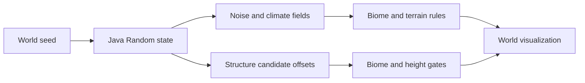
```mermaid
flowchart LR
    A["World seed"] --> B["Java Random state"]
    B --> C["Noise and climate fields"]
    B --> D["Structure candidate offsets"]
    C --> E["Biome and terrain rules"]
    D --> F["Biome and height gates"]
    E --> G["World visualization"]
    F --> G
```

### How to read the accuracy labels

The repository separates two kinds of result:

- **Exact or Java-compatible** means the implementation follows the stated Java 1.16.1 arithmetic, bit width, seed transform, graph topology, or placement constants.
- **Source-informed explanatory model** means the visualization preserves the mechanism and coordinate relationships but does not claim to reproduce every block from a vanilla save.

The distinction matters. A structure candidate can be mathematically exact while the coloured biome underneath it is an intentionally readable climate model. Each section states where that boundary lies.

## Mathematical Foundation

### Java's 48-bit generator

#### The idea

Minecraft needs a repeatable stream of values that look random. If two worlds use the same seed and the same sequence of calls, they must receive the same answers. Java's `Random` class accomplishes this by storing a 48-bit internal state and repeatedly transforming it.

If the current state is $X_n$, the next state is

$$
X_{n+1} = (aX_n + c) \bmod 2^{48},
$$

where

$$
a = 25214903917, \qquad c = 11.
$$

This can be read as four small operations:

1. Multiply the current state by a fixed number.
2. Add 11.
3. Keep only the lowest 48 bits.
4. Return selected high bits as the next random value.

The modulus is not decorative notation. It is the rule that wraps a number back into the finite set of $2^{48}$ possible states. Replacing this generator with NumPy's default random generator would produce plausible-looking points, but not Minecraft's points.

#### The matching code

[`Code/core/lcg.py`](Code/core/lcg.py) performs the same masked update:

```python
class MinecraftLCG:
    MULTIPLIER = 0x5DEECE66D
    ADDEND = 0xB
    MASK = (1 << 48) - 1

    def next_bits(self, bits):
        self.seed = (self.MULTIPLIER * self.seed + self.ADDEND) & self.MASK
        return self.seed >> (48 - bits)
```

The hexadecimal mask is $2^{48}-1$. Applying `& MASK` therefore keeps exactly the same 48 low bits as the mathematical modulus.

### Noise, scale, and Brownian composition

#### Why random dots do not make terrain

Independent random values jump sharply from one coordinate to the next. Terrain needs spatial memory: nearby coordinates should usually receive similar values, while distant coordinates may belong to completely different landforms.

A useful explanatory model is fractal Brownian motion:

$$
\mathcal{N}(x,z) = \sum_{k=0}^{n-1} p^k\,\eta(f^k x, f^k z).
$$

Here:

- $(x,z)$ is a horizontal world coordinate.
- $\eta$ is one smooth noise field.
- $k$ identifies a scale, often called an octave.
- $f$ increases the spatial frequency from one octave to the next.
- $p$ reduces the amplitude of finer octaves.

For $f=2$ and $p=1/2$, the first layer might describe a continent, the next a region, and the next local terrain detail. Each layer changes twice as quickly but contributes half as strongly.

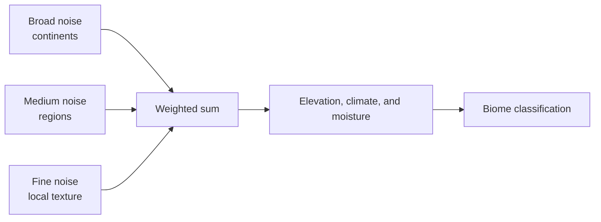
```mermaid
flowchart LR
    A["Broad noise<br/>continents"] --> D["Weighted sum"]
    B["Medium noise<br/>regions"] --> D
    C["Fine noise<br/>local texture"] --> D
    D --> E["Elevation, climate, and moisture"]
    E --> F["Biome classification"]
```

[`Code/core/minecraft_visuals.py`](Code/core/minecraft_visuals.py) samples broad, medium, detail, climate, and moisture fields in world coordinates. The same seed and coordinate refer to the same explanatory biome field even when two figures use different zoom levels.

The renderer also defines reusable `BiomeDefinition` objects. A biome definition owns its name, dimension, base colour, accent colour, and texture rule. Mushroom fields receive a distinct mycelium-like texture, badlands receive terracotta bands, snowy tundra receives pale icy detail, taiga receives spruce-like flecks, and the Nether forests retain their characteristic crimson and blue-green palettes.

## Visualizations

### Dragon Pathfinding

#### What is being modelled?

The Ender Dragon does not choose every position in the sky independently. Java 1.16.1 defines 24 horizontal navigation nodes arranged in three rings:

- 12 outer nodes near a radius of 60 blocks
- 8 middle nodes near a radius of 40 blocks
- 4 inner nodes near a radius of 20 blocks

Edges state which node transitions are legal. Fight phases decide which goals are relevant, and continuous steering carries the dragon between those goals.

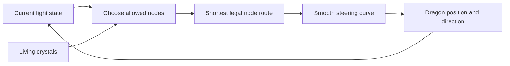
```mermaid
flowchart LR
    A["Current fight state"] --> B["Choose allowed nodes"]
    C["Living crystals"] --> B
    B --> D["Shortest legal node route"]
    D --> E["Smooth steering curve"]
    E --> F["Dragon position and direction"]
    F --> A
```

#### The mathematics

For an edge from node $u$ to node $v$, the top-down travel cost is its Euclidean length:

$$
w(u,v) = \lVert \mathbf{x}_u-\mathbf{x}_v \rVert_2.
$$

The shortest known cost to a node $v$ is then

$$
d(v) = \min_{u\rightarrow v}\left[d(u)+w(u,v)\right].
$$

The equation says: to reach $v$, consider every legal predecessor $u$, add the cost already required to reach $u$, add the final edge length, and keep the cheapest result.

Crystals also affect the simplified perch decision:

$$
P(\text{perch}) = \frac{1}{3+n_{\mathrm{crystals}}}.
$$

With ten crystals alive, the chance is $1/13$, or about $7.7\%$. With no crystals alive, it becomes $1/3$, or about $33.3\%$. Destroying crystals therefore changes both healing pressure and the probability of a landing attempt.

#### The matching code

[`Code/core/dragon.py`](Code/core/dragon.py) keeps graph restrictions separate from edge cost:

```python
minimum_node = 0 if crystals_alive > 0 else 12
allowed = set(range(minimum_node, 24))

for neighbor in adjacency[current]:
    if neighbor not in allowed:
        continue
    weight = np.linalg.norm(DRAGON_NODES[current] - DRAGON_NODES[neighbor])
```

The graph selects meaningful targets. Every graph-bound portion of a seeded route is expanded through legal decoded edges, then a reduced top-down integrator applies the source movement terms: wrapped yaw error, a $\pm50^\circ$ turn clamp, retained turn momentum, alignment-sensitive acceleration, and velocity damping. This prevents disconnected chords and the old rigid boundary-following motion. It is still a two-dimensional explanatory projection of the three-dimensional entity controller, not a block-exact replay.

#### The animation


The large left panel shares one block-coordinate system for the End island, node graph, spike footprints, cages, fountain, dragon, fireball, breath clouds, explosions, and recent trail. Grey lines show legal graph edges. The enlarged raster sprite rotates with its direction of travel and strongly adopts the colour of its active phase while leaving the graph readable.

The right panel shows all 11 Java 1.16.1 phase types and highlights every one at least once. Solid arrows follow source-confirmed phase changes: Holding can enter Strafe or Landing Approach; Landing Approach enters Landing and then Sitting Scanning; scanning can attack, take off, or select Charging Player; attacking enters Flaming; and Takeoff, Strafe, and Charging Player return to Holding. Dashed arrows identify initialization and damage-triggered paths. In particular, sufficient damage while sitting or hovering forces Takeoff, while lethal airborne damage can enter Dying. The currently selected phase alone receives a thick white outline.

The dashboard labels the probability as the next Holding-path landing roll. Its value is $1/(3+n_\mathrm{crystals})$, not a continuous per-frame chance. Faceted crystal indicators mirror the surviving, non-circular destruction order on the island. Crystal destruction remains an external scripted demonstration event. The Strafe example launches a translucent purple dragon fireball whose impact cloud grows from radius 3 toward radius 7. Sitting Flaming separately displays a growing, fading radius-5 breath cloud, followed by a visible damage pulse that triggers the source-valid Takeoff path. The timings and radii follow the audited phase and entity sources; their top-down particle rendering is illustrative.

#### Phase details

<table>
<tr>
<th>Holding and Strafing</th>
<th>Landing, Perched Decisions, and Charging</th>
<th>Takeoff and Return</th>
</tr>
<tr>
<td>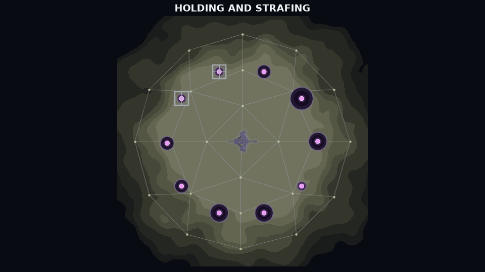</td>
<td>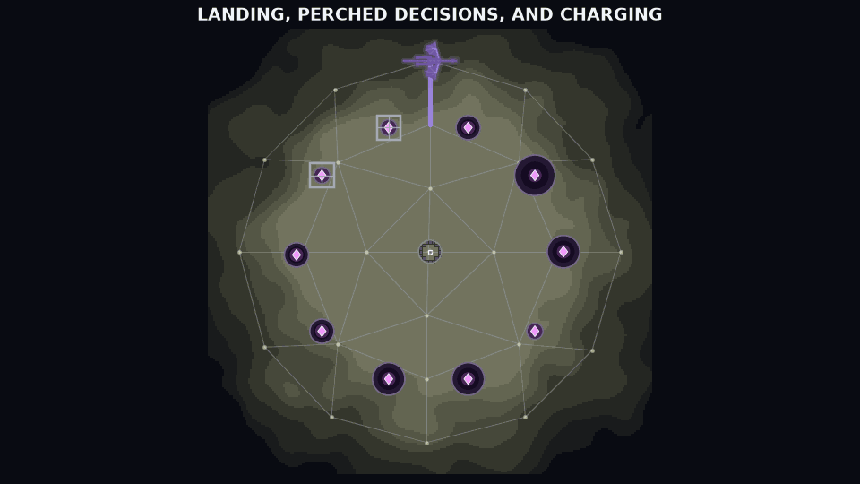</td>
<td>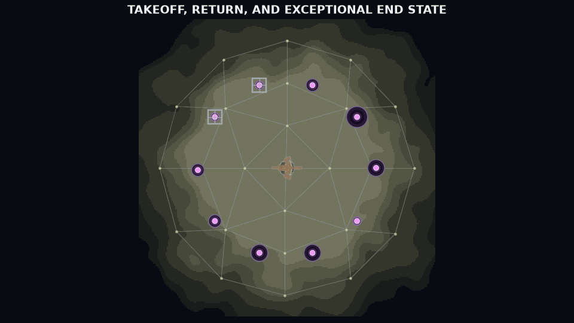</td>
</tr>
</table>

These shorter clips retain the same arena, source-shaped steering, raster sprite, and state colours. A fixed close view keeps the fight geometry legible, while permanent titles replace the changing annotation boxes that previously obscured the action.

### Trajectory Distribution and Degeneracy

#### From one path to many paths

One route shows what happened in one simulation. An ensemble asks which locations remain important across many seeds and starting states.

For trajectories $\gamma_i(t)$, a spatial occupancy field can be written as

$$
D(x,z) = \sum_i \sum_t K_h\!\left((x,z)-\gamma_i(t)\right),
$$

where $K_h$ deposits density near each sampled flight position. Bright regions are visited repeatedly.

The right-hand frequency chart uses a stricter count. A trajectory contributes at most once to a spatial cell:

$$
F_{ab} = \sum_i \mathbf{1}\!\left[\gamma_i \text{ enters cell } (a,b)\right].
$$

This prevents a slow trajectory from inflating a cell merely because it supplied many nearby samples. High $F_{ab}$ values identify repeatable approach corridors and critical flight cells. The shared 24-block fountain-approach zone is excluded from hotspot ranking because every landing route would otherwise report the same trivial terminal funnel.

[`Code/dragon_pathfinding.py`](Code/dragon_pathfinding.py) forms a binary grid contribution for each trajectory:

```python
histogram, _, _ = np.histogram2d(path[:, 1], path[:, 0], bins=(bins, bins))
contributions.append(histogram > 0)
cumulative = np.cumsum(np.asarray(contributions), axis=0)
```

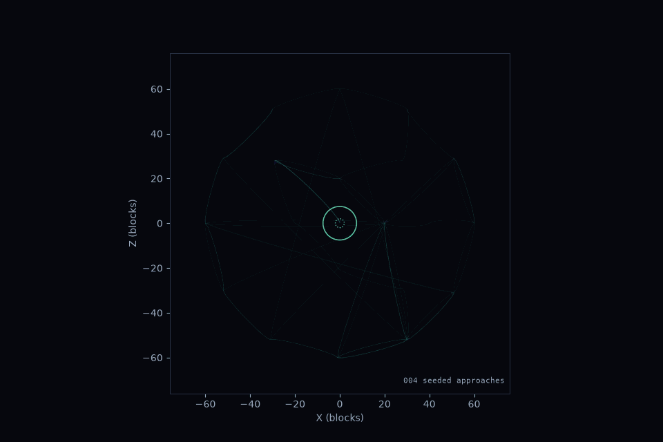

The figure accumulates 240 seeded approaches in fixed batches. Player targets are distributed deterministically across a 24-to-48-block annulus so the result measures route degeneracy rather than one fixed landing direction. All graph-bound node transitions are legal decoded edges, and the same source-shaped steering integrator used by the hero supplies continuous motion. A higher-density raster keeps the left map crisp, while the enlarged representative dragon and its recent trail adopt the active route colour.

The right panel fixes the final separated local-maximum cells so their labels do not jump during the animation, then accumulates their distinct-route counts from exactly the routes shown so far. Hollow markers on the map identify those same cells. Both bar length and a fixed min-to-max viridis scale encode frequency, so small but meaningful differences remain visible. These are repeatability hotspots in the path ensemble, not a direct model of arrow damage or the complete one-shot combat setup used by speedrunners.

### End Dimension Structure

#### Three very different scales

The End figure combines central fight geometry, the first outer-island band, and a distant integer-overflow effect.

Ten spike positions occupy a nominal radius of 42 blocks:

$$
\mathbf{p}_k = 42\left(\cos\frac{2\pi k}{10},\ \sin\frac{2\pi k}{10}\right),
\qquad k=0,\ldots,9.
$$

Twenty post-fight gateways occupy a radius of 96 blocks:

$$
\mathbf{g}_k = \left(
\left\lfloor96\cos\frac{\pi k}{10}\right\rfloor,
\left\lfloor96\sin\frac{\pi k}{10}\right\rfloor
\right).
$$

Far from the origin, Java's signed 32-bit arithmetic changes the End density calculation. First define the eight-block sample coordinates

$$
u_x=\mathrm{trunc}(x/8), \qquad u_z=\mathrm{trunc}(z/8).
$$

Then compute

$$
q(x,z)=\mathrm{signed32}\!\left(u_x^2+u_z^2\right).
$$

The relevant terrain branch remains valid when $q(x,z)\ge 0$. When the signed integer wraps below zero, an invalid square-root path produces a void band. The first affected eight-block cell starts at 370,720 blocks and the first strictly void sample occurs at 370,728 blocks.

[`Code/core/end_generation.py`](Code/core/end_generation.py) applies the wrap explicitly:

```python
sample_x = np.trunc(x / 8.0).astype(np.int64)
sample_z = np.trunc(z / 8.0).astype(np.int64)
unsigned = (sample_x * sample_x + sample_z * sample_z) & 0xFFFFFFFF
signed = np.where(unsigned >= 0x80000000, unsigned - 0x100000000, unsigned)
generated = signed >= 0
```

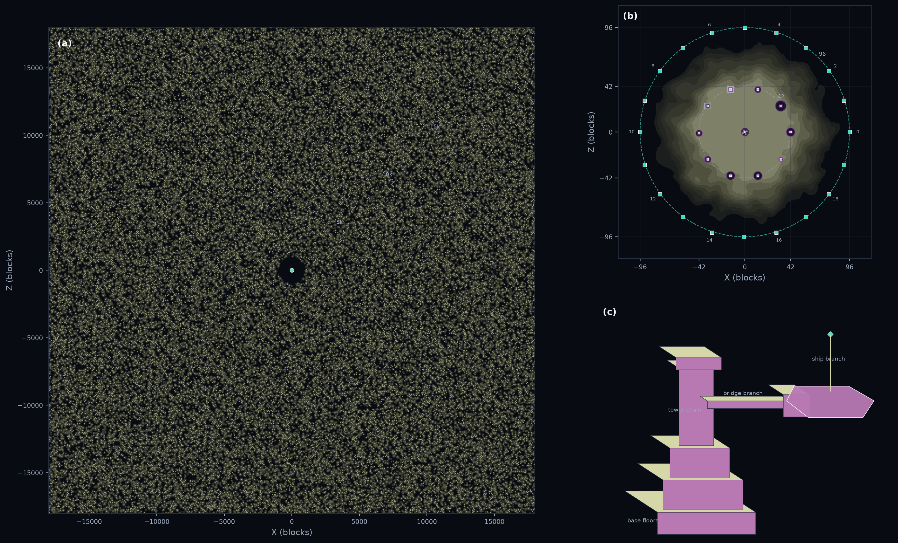

Panel (a) samples the exact predicate across approximately $\pm30$ million blocks, near the ordinary world-border scale. The underlying void bands are centered on the true origin, as described by [Mojang issue MC-159283](https://bugs-legacy.mojang.com/browse/MC-159283). Because the bands become extremely thin, a regular image grid undersamples them. The resulting map-scale alias looks like a repeating checkerboard lattice, matching the archived visual reference. The apparent circles are not new End origins.

Panel (b) shows the fight-scale island, spike ring, emphasized cages, active exit fountain, and all 20 central gateways. Panel (c) shows the first outer-island source band as many separate seed sites rather than one continuous ring of End stone.

### End Structure Generation

#### End cities and paired gateways

End cities use a random-spread grid before biome and terrain-height checks. For a 20-chunk spacing and 11-chunk separation, the candidate window is

$$
w=20-11=9 \text{ chunks}.
$$

End cities use the center-biased form of the random-spread rule. For each axis, Java Random draws twice from $\{0,\ldots,8\}$ and integer-averages the results, making central offsets more likely than edge offsets. The placement salt is 10387313.

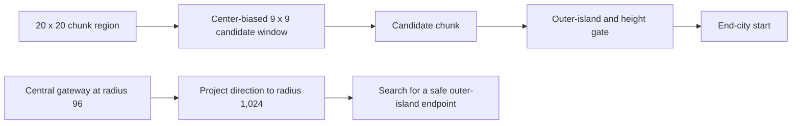
```mermaid
flowchart LR
    A["20 x 20 chunk region"] --> B["Center-biased 9 x 9 candidate window"]
    B --> C["Candidate chunk"]
    C --> D["Outer-island and height gate"]
    D --> E["End-city start"]
    F["Central gateway at radius 96"] --> G["Project direction to radius 1,024"]
    G --> H["Search for a safe outer-island endpoint"]
```

[`Code/core/end_generation.py`](Code/core/end_generation.py) uses the exact End-city candidate grid, derives the source rotation from `chunkX + chunkZ * 10387313`, and evaluates the minimum of the four rotated surface samples used by Java 1.16.1. The repository does not reproduce the complete three-dimensional End chunk generator, so those four values come from a clearly labeled two-dimensional modeled `WORLD_SURFACE_WG` height field rather than a block-exact save.

For gateway $k$, the ideal outer direction is

$$
\mathbf{o}_k = 1024\left(\cos\frac{2\pi k}{20},\ \sin\frac{2\pi k}{20}\right).
$$

The plot then snaps that ideal vector to the nearest qualified outer-island source site, standing in for the safe-position search performed by the gateway system.

For candidate origin $(x,z)$ and source-selected offsets $(\Delta x,\Delta z)$, the displayed gate is

$$
H_{\min}=\min\{H(x,z),H(x+\Delta x,z),H(x,z+\Delta z),H(x+\Delta x,z+\Delta z)\},
\qquad H_{\min}\geq60.
$$

The offset signs come from one of the four rotations and have five-block magnitude. Candidate placement, rotation, sample geometry, minimum operation, and threshold are source-exact; only the height surface supplying $H$ is modeled.

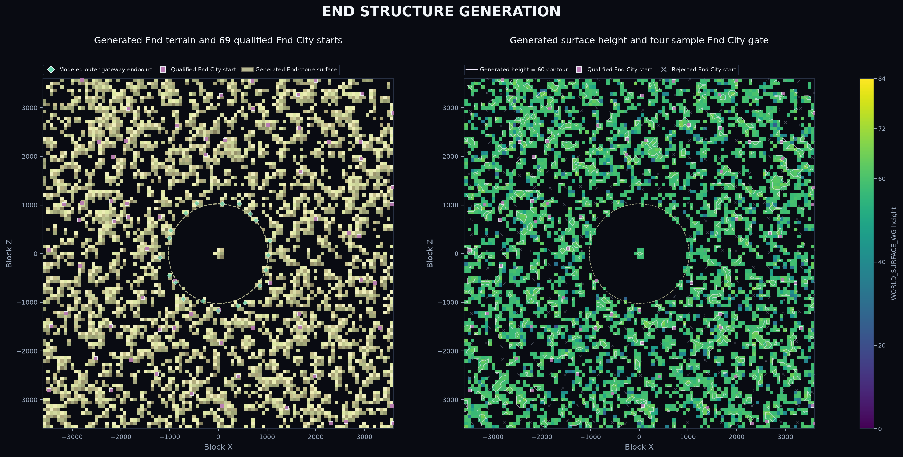

The left panel projects complete visible outer-island footprints from every qualifying local source site, making the dense island field readable without turning each source into an isolated dot. Subtle cyan diamonds retain the exact radius-96 central gateways without competing with the structure field. Enlarged purpur ship glyphs mark candidates whose modeled four-sample minimum reaches 60.

The equally sized right panel repeats the left map extent as a viridis heatmap of the modeled surface height, with its colourbar on the right and the 60-block contour drawn directly on the field. Grey crosses show failed exact-grid candidates and ship glyphs show modeled passes. Visible legends distinguish gateways, outer-island support, qualified starts, and failures without sacrificing a quarter of the map to a diagnostic inset. The glyph is symbolic: it does not claim that every qualified city generates a ship or reproduce the final template assembly of a particular vanilla save.

### Radial World Generation

#### Chunk generation is a dependency wave

A chunk does not move directly from nonexistent to finished. Java 1.16.1 advances it through an ordered sequence of statuses such as biomes, noise, surface, carvers, features, lighting, spawn preparation, heightmaps, and full completion.

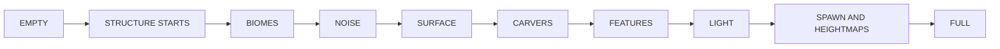
```mermaid
flowchart LR
    A["EMPTY"] --> B["STRUCTURE STARTS"]
    B --> C["BIOMES"]
    C --> D["NOISE"]
    D --> E["SURFACE"]
    E --> F["CARVERS"]
    F --> G["FEATURES"]
    G --> H["LIGHT"]
    H --> I["SPAWN AND HEIGHTMAPS"]
    I --> J["FULL"]
```

Neighbouring chunks introduce dependencies, so a center chunk can advance only while wider shells have reached the statuses it requires. The displayed status at Chebyshev distance $d$ is

$$
s_d(t)=\min\left(\left\lfloor12t\right\rfloor,T(d)\right),
$$

where $t$ is normalized animation progress and $T(d)$ is the source-required terminal status for that shell. The schedule is explanatory, but the terminal dependency profile is source-mapped.

This modeled wave determines *when* a chunk may expose each result. Its final targets, however, come directly from Java 1.16.1 `ChunkStatus`: Chebyshev distance 0 reaches `FULL`, distance 1 reaches `FEATURES`, distance 2 reaches `LIQUID_CARVERS`, and distances 3 through 10 reach `STRUCTURE_STARTS`. The Brownian-style composition introduced in [Noise, scale, and Brownian composition](#noise-scale-and-brownian-composition) supplies source-informed terrain context underneath the status field.

[`Code/seed_loading.py`](Code/seed_loading.py) implements that relationship directly:

```python
target[distances <= 10] = STRUCTURE_STARTS
target[distances == 2] = LIQUID_CARVERS
target[distances == 1] = FEATURES
target[distances == 0] = FULL
stages = np.minimum(int(np.floor(12 * progress)), target)
```

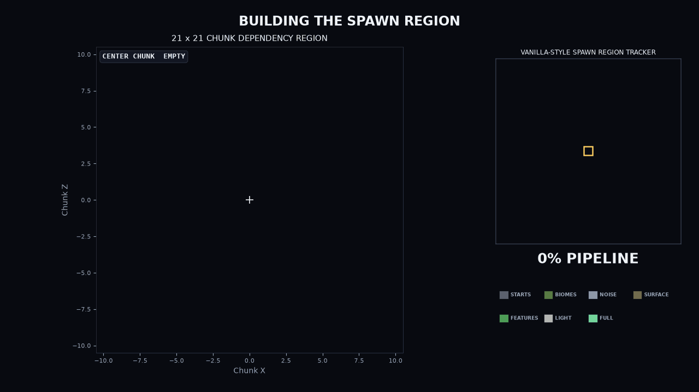

The broad overview shows an illustrative radial request front across 721 by 721 chunks, comparable in scope to the other structure maps. A dashed 21 by 21 footprint marks the exact dependency example around the target. The complete inset advances through the 13-status order and caps each Chebyshev ring at its source-required terminal status. Request direction and timing are explanatory; the terminal rings and status taxonomy are the scientific result.

### Overworld Structure Generation

#### Candidate first, biome second

Many structures begin by dividing the chunk plane into placement regions. For world seed $W$, region coordinate $(R_x,R_z)$, and structure salt $\sigma$, the region seed is

$$
S=W+341873128712R_x+132897987541R_z+\sigma.
$$

For spacing $d$ and separation $s$, the usable candidate window is

$$
w=d-s.
$$

Most structures in this figure use a center-biased offset:

$$
J_x=\left\lfloor\frac{A_x+B_x}{2}\right\rfloor,
\qquad A_x,B_x\in\{0,\ldots,w-1\},
$$

with the same construction for $J_z$. Averaging two draws makes central offsets more common than edge offsets. Ocean monuments use a uniform draw instead. The candidate chunk is

$$
c_x=dR_x+J_x, \qquad c_z=dR_z+J_z.
$$

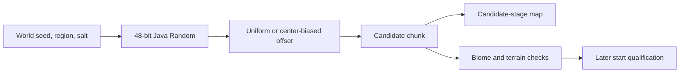
```mermaid
flowchart LR
    A["World seed, region, salt"] --> B["48-bit Java Random"]
    B --> C["Uniform or center-biased offset"]
    C --> D["Candidate chunk"]
    D --> E["Candidate-stage map"]
    D --> F["Biome and terrain checks"]
    F --> G["Later start qualification"]
```

[`Code/core/structures.py`](Code/core/structures.py) keeps the exact offset rule separate from later biome and terrain qualification:

```python
if config.uniform:
    offset_x = random.next_int(window)
else:
    offset_x = (random.next_int(window) + random.next_int(window)) // 2
```

The visualization includes villages, desert pyramids, jungle pyramids, swamp huts, pillager outposts, igloos, woodland mansions, ocean monuments, shipwrecks, ocean ruins, and ruined portals. Each family keeps its own spacing, separation, salt, and offset distribution. Pillager outposts additionally apply their source-level one-in-five roll and nearby-village exclusion. All other points remain candidate-stage positions, avoiding a false claim that the two-dimensional backdrop reproduces Minecraft's full biome and terrain start checks.

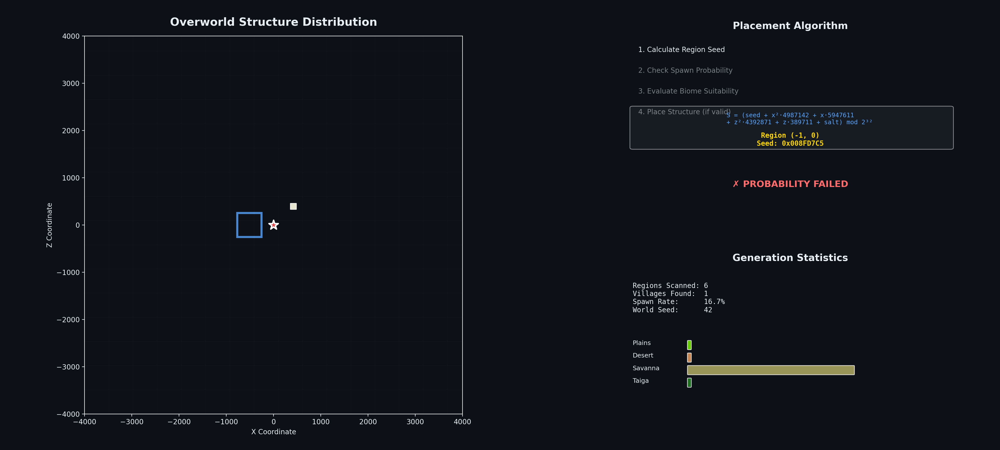

The map is measured in chunks and retains every in-bounds candidate for the displayed structure families. Faint 32-chunk lines provide a common reference, while the cyan outline shows the currently active structure region and the dashed fill shows its usable candidate window. A fixed detail inset preserves local structure plans without covering either axis label.

Candidates use compact, structure-specific symbols so all in-bounds points remain visible at the wider scale. The right side identifies every symbol and every textured terrain class. The backdrop is source-informed coordinate-consistent context, not a biome-compatibility filter or a claim of exact vanilla biome rarity.

### Nether Structure Generation

#### Shared and independent random sequences

Nether fortresses and bastion remnants share one Java 1.16.1 candidate grid. Each 27 by 27 chunk region has a 23 by 23 candidate window. After the candidate offsets, Java Random draws

$$
r=\mathrm{nextInt}(5).
$$

Rolls 0 and 1 choose a fortress. Rolls 2, 3, and 4 choose a bastion:

$$
P(\text{fortress})=\frac{2}{5}, \qquad
P(\text{bastion})=\frac{3}{5}.
$$

Ruined portals use an independent 25 by 25 region grid, a 15 by 15 candidate window, and a different seed path. Sharing a dimension does not mean sharing a random sequence.

[`Code/core/structures.py`](Code/core/structures.py) makes the shared type roll explicit:

```python
offset_x = random.next_int(23)
offset_z = random.next_int(23)
type_roll = random.next_int(5)
structure_type = 'fortress' if type_roll < 2 else 'bastion'
```


The main map is framed tightly enough for candidate symbols and biome context to remain readable. Subtle red lines show every fifth shared fortress-or-bastion region boundary and purple dotted lines show every fifth independent ruined-portal boundary, avoiding an unreadable grid at this scale. The wider detail inset retains the exact active grids and local structure plans without covering the horizontal axis label.

Compact symbols distinguish every displayed fortress, bastion, and ruined-portal candidate without hiding the wider field. The backdrop assigns the five source biomes by nearest distance to the Java 1.16.1 multi-noise prototypes using four seeded proxy fields. Lava is separately labeled as terrain, not a biome. Every exact candidate within the frame is retained: fortresses and ruined portals accept all five displayed biome classes, while bastions exclude basalt deltas at the later biome gate. Because the Double Perlin samplers are not reproduced, biome shapes and rarity remain an explanatory proxy rather than exact seed output.

### Stronghold Ring Distribution

#### Why strongholds form rings

Strongholds do not use a rectangular random-spread grid. Java 1.16.1 advances through polar coordinates. A useful expression for the candidate radius in chunks is

$$
r_i=128+192i+\left(U-\frac12\right)80,
\qquad U\sim\mathcal{U}(0,1).
$$

The ring index $i$ moves the baseline radius outward. The random term moves an individual candidate within that ring's radial band. Angles divide the ring among its candidates, and a seeded angular offset rotates the following ring.

The eight populations are

$$
3,\ 6,\ 10,\ 15,\ 21,\ 28,\ 36,\ 9,
$$

which sum to 128.

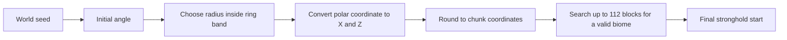
```mermaid
flowchart LR
    A["World seed"] --> B["Initial angle"]
    B --> C["Choose radius inside ring band"]
    C --> D["Convert polar coordinate to X and Z"]
    D --> E["Round to chunk coordinates"]
    E --> F["Search up to 112 blocks for a valid biome"]
    F --> G["Final stronghold start"]
```

[`Code/core/strongholds.py`](Code/core/strongholds.py) preserves the ring iterator and Java rounding:

```python
radius_chunks = (
    4 * 32 + 6 * ring_index * 32
    + (random.next_double() - 0.5) * 32 * 2.5
)
x = java_round(math.cos(angle) * radius_chunks) * 16
z = java_round(math.sin(angle) * radius_chunks) * 16
```

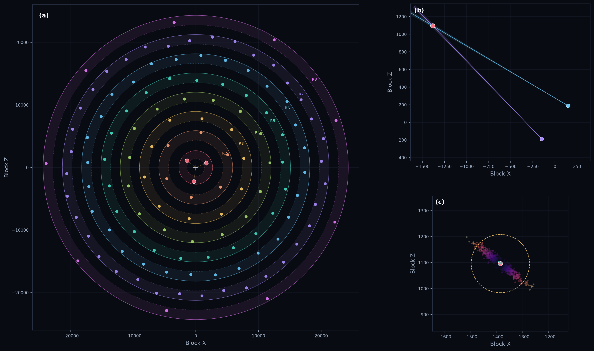

Panel (a) shows all 128 pre-biome-search candidates. Coloured radial bands show each ring's allowed range, while enlarged dots and stronger boundaries keep the exact geometry above the faded biome field.

Panel (b) is a true coordinate-consistent view of the same seed near the first ring. Dashed gold circles show the 112-block biome-search neighbourhood around each preliminary candidate. The backdrop includes visible mushroom fields, badlands, winter terrain, taiga, ocean, jungle, and other biome classes without changing the stronghold arithmetic.

Panel (c) separates two quantities that were previously easy to confuse. Bar height is the number of candidates in a ring. The compact label beneath each ring gives its radial band in thousands of blocks. The first ring spans 1,408 to 2,688 blocks from the world origin.

## Quick Start

```bash
git clone https://github.com/IsolatedSingularity/Minecraft-Generation.git
cd Minecraft-Generation
pip install -r requirements.txt

# Run numerical and asset checks
python -m unittest discover -s tests -v

# Generate all active visualizations
cd Code
python render_all.py
```

Run `render_all.py` from inside `Code/`. The visualization modules use sibling imports, so invoking `python Code/render_all.py` from the repository root is not supported.

## Scope and Accuracy

> [!NOTE]
> Active mathematical visualizations target Java Edition 1.16.1. Java Random, candidate-region arithmetic, stronghold ring geometry, gateway-ring positions, dragon graph topology, End-city sample geometry, and signed-integer overflow use Java-compatible conventions. Biome noise fields, chunk reveal timing, continuous two-dimensional dragon steering, modeled End heights, and safe outer-gateway destinations are explanatory models unless a section states otherwise. No Bedrock behaviour is represented.

> [!IMPORTANT]
> The biome-heavy README maps intentionally compress rare-biome spacing so every class can be inspected in one figure. Colours, textures, climate relationships, coordinates, and structure compatibility are meaningful. The apparent frequency of rare biomes is not a vanilla rarity claim.

> [!TIP]
> For speedrunning, first-ring stronghold candidates occur 1,408 to 2,688 blocks from origin. Eye triangulation still targets the final biome-adjusted stronghold, not merely the preliminary ring point.

## References

1. [Minecraft Wiki](https://minecraft.wiki/): mechanics, biome appearance, and historical version context.
2. [OpenJDK `java.util.Random`](https://github.com/openjdk/jdk/blob/master/src/java.base/share/classes/java/util/Random.java): Java LCG behaviour and bounded-integer rejection.
3. [Fabric Yarn 1.16.1 `ChunkStatus`](https://maven.fabricmc.net/docs/yarn-1.16.1%2Bbuild.10/net/minecraft/world/chunk/ChunkStatus.html): source-mapped chunk status order.
4. [Fabric Yarn 1.16.1 `StructureConfig`](https://maven.fabricmc.net/docs/yarn-1.16.1%2Bbuild.10/net/minecraft/world/gen/chunk/StructureConfig.html): spacing, separation, and salt configuration.
5. [Fabric Yarn 1.16.1 `StructureFeature`](https://maven.fabricmc.net/docs/yarn-1.16.1%2Bbuild.10/net/minecraft/world/gen/feature/StructureFeature.html): structure families and candidate-stage context.
6. [Fabric Yarn `EndCityFeature`](https://maven.fabricmc.net/docs/yarn-1.17.1%2Bbuild.10/net/minecraft/world/gen/feature/EndCityFeature.html): End-city terrain-height qualification retained from the 1.16 generation family.
7. [Mojang MC-159283](https://bugs-legacy.mojang.com/browse/MC-159283): distant End terrain loss caused by integer overflow.
8. [Deltanic's End overflow derivation](https://gist.github.com/Deltanic/b98d005c9025f10a67de9e966fa57ebb): transition sequence linked from the Mojang issue.
9. [Alan Zucconi, Minecraft World Generation](https://www.alanzucconi.com/2022/06/05/minecraft-world-generation/): accessible procedural-generation background.
10. [Fabric Yarn 1.16.1 `PhaseType`](https://maven.fabricmc.net/docs/yarn-1.16.1%2Bbuild.10/net/minecraft/entity/boss/dragon/phase/PhaseType.html): the complete 11-type Ender Dragon phase taxonomy.

*Author: Jeffrey Morais*

## Legacy Simulations

The original dragon animation is retained as a record of the project's earlier reduced-order model. It uses an abstract arena and a larger dashboard rather than the current source-informed central-island projection. Its unconstrained curves helped motivate the smoother steering restored in the new hero, but its graph, effects, and geometry are not used as evidence for current numerical claims.


## Scroll of Forbidden Knowledge

<details>
<summary>The Scroll of Forbidden Knowledge</summary>

```
The ancient texts speak of seeds most cursed:

Seed 164311266871034 - Where villages fear to spawn
Seed 1785852800490   - The stronghold that wasn't
Seed 27594263        - Portal room behind bedrock

Some seeds are best left unplanted.

Also, did you know Herobrine's removal was never actually implemented?
The changelog lies. He watches through the Perlin noise.
Always 3 chunks behind. Always listening for footsteps.

The generation is deterministic.
Your survival is not.

The dragon has circled 2^48 times before.
It will circle 2^48 times again.
You are merely the current observer.

Some say if you calculate the exact moment
when the LCG state equals your world seed,
you can hear the algorithm thinking.

But that's just superstition.

Isn't it?

- Translated from the Ender Tongue, circa 2011
```

</details>
