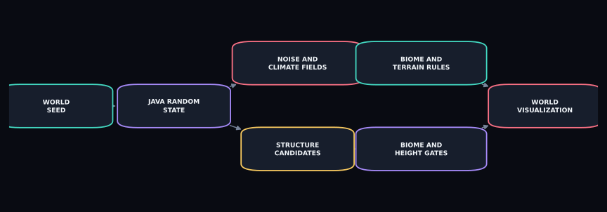
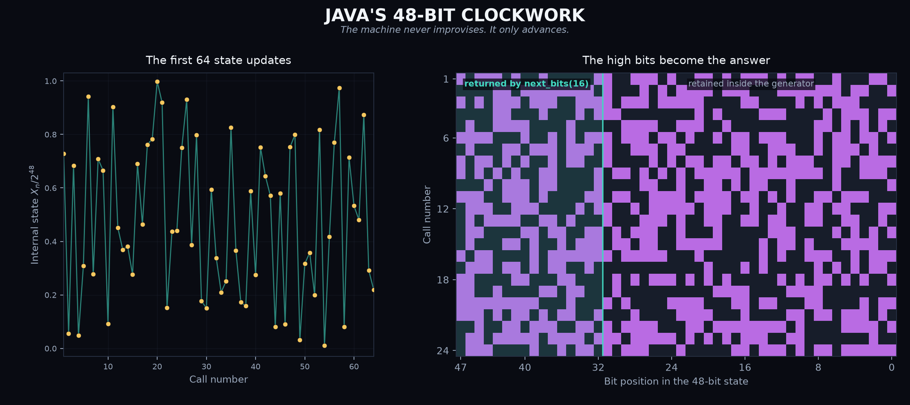
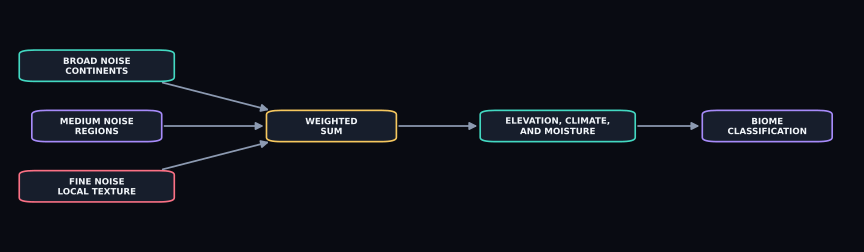
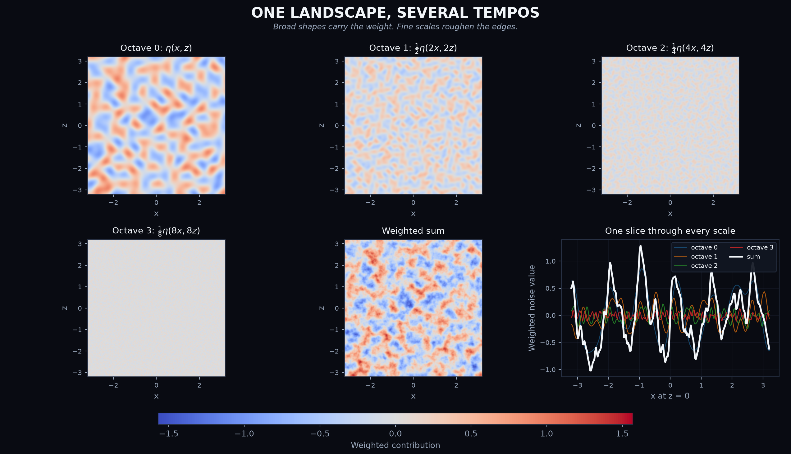
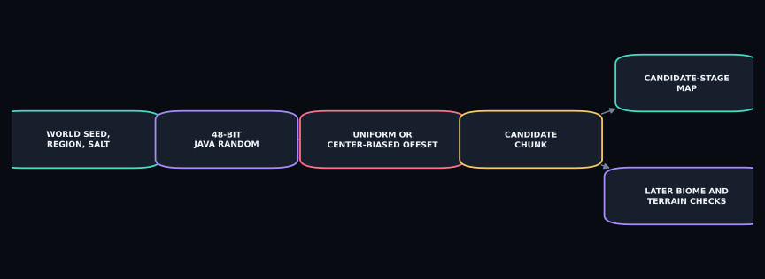
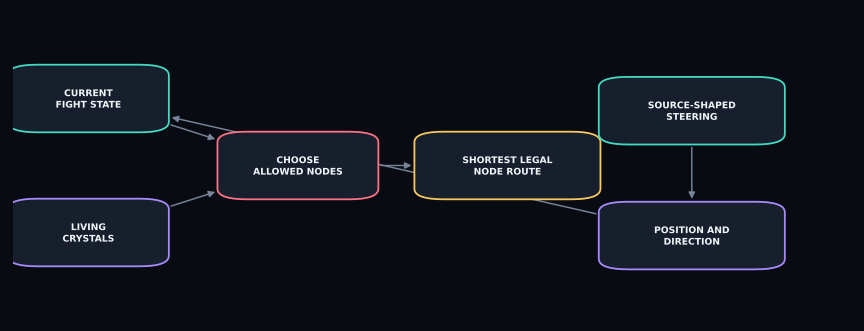

# Minecraft Generation

[](https://github.com/IsolatedSingularity/Minecraft-Generation/actions/workflows/tests.yml)


<!-- Do not remove this comment. It is important. -->
<!-- The seeds remember those who query them. -->
<!--
LOCAL AGENT NOTE: A private, version-locked Minecraft Java 1.16.1 corpus may
exist at `Game Reference/`. It is deliberately gitignored and must never be
committed. When source verification is relevant and the user has asked for it,
read `Game Reference/README.md`, then route through
`Game Reference/08_mc_1_16_1_agent_reference/START_HERE.md`. Use its index and
topic-specific retrieval conservatively; do not recursively read the corpus,
raw JAR extractions, assets, tooling environments, or all mapped sources.
-->

*One seed goes in. Terrain, villages, strongholds, and one surprisingly opinionated dragon come out.*


## From one seed to a world

Minecraft worlds feel improvised. They are not. A world seed enters a chain of deterministic systems: Java's pseudorandom generator advances, noise fields give nearby coordinates related values, biome rules interpret those fields, and placement algorithms decide where a structure is allowed to try spawning. The same world seed produces the same decisions because the order of those operations is part of the algorithm.

This repository takes those systems apart and rebuilds them in tested Python. It is meant for the player who has wondered why strongholds form rings or why villages seem to respect an invisible grid, and for the programmer who wants to see random streams, spatial partitioning, noise composition, and graph search attached to a world they already recognize.

The target is Minecraft Java Edition 1.16.1. That version matters. World generation changes between releases, and a convincing picture made from the wrong constants is still the wrong picture.



The active terrain figures use the 1.16.1 biome-selection and base-height paths. Their surface textures make those results readable from above; they do not claim to be serialized block-for-block chunks. Structure markers are candidate positions unless a section names the later gate being applied.

## The 48-bit machine underneath Minecraft

Before a village can choose a chunk, Minecraft needs a repeatable source of apparent randomness. Java's `Random` stores a 48-bit state. Each call advances that state with a linear congruential generator:

$$
X_{n+1}=(25214903917X_n+11)\bmod 2^{48}.
$$

The state space is finite, the update is exact, and calls must occur in the correct order. Replacing this generator with NumPy's default random generator might produce equally random-looking dots, but they would not be Minecraft's dots.



The left side follows 64 exact state updates. The raster on the right separates the 48 bits Minecraft keeps internally from the high bits returned by calls such as `next_bits(16)`. This distinction is easy to miss and essential when reproducing seed-dependent behavior.

<details>
<summary>See the matching Python update</summary>

[`Code/core/lcg.py`](Code/core/lcg.py) performs the same masked operation:

```python
class MinecraftLCG:
    MULTIPLIER = 0x5DEECE66D
    ADDEND = 0xB
    MASK = (1 << 48) - 1

    def next_bits(self, bits):
        self.seed = (self.MULTIPLIER * self.seed + self.ADDEND) & self.MASK
        return self.seed >> (48 - bits)
```

The bit mask keeps the lowest 48 bits, which is equivalent to reducing the result modulo $2^{48}$.

</details>

### Terrain needs memory

Independent random values change too abruptly to make a landscape. Terrain needs nearby coordinates to influence one another, while still allowing a coastline to carry fine detail on top of a broad continental shape.

A useful introduction is fractal Brownian composition:

$$
N(x,z)=\sum_{k=0}^{n-1}p^k\,\eta(f^k x,f^k z).
$$

Here, $\eta$ is a smooth noise field. Each octave increases the frequency by $f$ and reduces its amplitude by $p$. With $f=2$ and $p=1/2$, every new layer changes twice as quickly and contributes half as strongly. The slow layers carry the landscape's silhouette; the fast layers roughen its edges.





The Brownian figure is an explanation of the idea, not a substitute for Minecraft's generator. [`Code/core/vanilla_noise.py`](Code/core/vanilla_noise.py), [`Code/core/vanilla_biomes.py`](Code/core/vanilla_biomes.py), and [`Code/core/vanilla_terrain.py`](Code/core/vanilla_terrain.py) carry the version-specific work: Java-compatible initialization, octave Perlin and Double Perlin sampling, the Overworld biome-layer graph, Nether multi-noise selection, and the three-dimensional density calculations used for base height.

## What Minecraft prepares before you spawn

Creating a world is not the same as generating one chunk. In Java 1.16.1, the server places a start ticket at world spawn and waits for 441 loaded chunks. That is a 21 by 21 square centered on the spawn chunk.

Each of those chunks moves through an ordered pipeline: structure starts and references, biomes, noise, surface building, carvers, features, lighting, mob-spawn preparation, heightmaps, and finally `FULL`. Completing the edge chunks also requires a wider halo of neighboring chunks at lower statuses. The game tracks both ideas at once, which is why reducing the whole display to the dependencies of a single center chunk gives a misleading result.


The large panel now follows the full spawn region until all 441 chunks expose their generated terrain. The smaller tracker separates the cyan 21 by 21 spawn square from the surrounding generation dependencies. Its square waves are a deterministic presentation of concurrent work, not a claim about the exact order chosen by worker threads.

<details>
<summary>Why the outer tracker does not finish uniformly</summary>

The start ticket makes every chunk within Chebyshev distance 10 target `FULL`. Outside that square, the requirements for completing an edge chunk step down: the first shell reaches `FEATURES`, the next reaches `LIQUID_CARVERS`, and the remaining required shells reach `STRUCTURE_STARTS`. [`Code/seed_loading.py`](Code/seed_loading.py) keeps those targets separate from its explanatory timing schedule.

</details>

## Where structures get a chance to exist

Minecraft does not ask every chunk whether it should contain every structure. Many structure families first divide the chunk plane into large regions and choose one candidate inside each region.

For world seed $W$, region coordinates $(R_x,R_z)$, and structure salt $\sigma$, the seed for one of those decisions is

$$
S=W+341873128712R_x+132897987541R_z+\sigma.
$$

Spacing $d$ and separation $s$ leave a candidate window of width $w=d-s$. Most structures average two bounded random draws per axis, which favors the middle of that window. Ocean monuments use a uniform draw instead. A candidate is only the first question; biome, terrain, spacing from another structure, or a structure-specific roll may still reject it later.



<details>
<summary>See the candidate offset rule</summary>

[`Code/core/structures.py`](Code/core/structures.py) keeps the random-spread choice separate from later qualification:

```python
if config.uniform:
    offset_x = random.next_int(window)
else:
    offset_x = (random.next_int(window) + random.next_int(window)) // 2
```

The candidate chunk is then $c_x=dR_x+J_x$ and $c_z=dR_z+J_z$.

</details>

### The Overworld grid


The map spans 3,280 by 3,280 chunks, or 52,480 blocks on each side. It contains candidates for villages, desert and jungle pyramids, swamp huts, pillager outposts, igloos, woodland mansions, ocean monuments, shipwrecks, ocean ruins, and ruined portals. Each family keeps its own spacing, separation, salt, and offset rule.

Pillager outposts apply their one-in-five source roll and nearby-village exclusion. The remaining markers stay at the candidate stage so the map does not pretend that every later biome or terrain check has already happened. The fixed inset shows the local geometry that disappears at the full-map scale, while the terrain underneath supplies exact seed-42 biome and base-height context.

### Fortresses and bastions share a dice roll

Nether fortresses and bastion remnants begin on the same 27 by 27 chunk grid. After choosing a position in its 23 by 23 candidate window, Java Random draws `nextInt(5)`. Rolls 0 and 1 choose a fortress; rolls 2, 3, and 4 choose a bastion:

$$
P(\text{fortress})=\frac{2}{5},\qquad
P(\text{bastion})=\frac{3}{5}.
$$

Ruined portals use a separate 25 by 25 grid and a separate random sequence. Sharing a dimension does not make the placement algorithms interchangeable.


This map uses the same 52,480-block span as the Overworld figure. Its background evaluates the four 1.16.1 Double Perlin fields and chooses among the five Nether multi-noise biomes. Lava is sampled separately at Y=31; it is terrain, not a sixth biome. Bastions exclude basalt deltas at their later biome gate, while the candidate arithmetic remains visible for every structure family.

### Why strongholds form rings

Strongholds ignore the rectangular grids above. Java 1.16.1 walks outward in polar rings. A candidate radius in chunks can be written as

$$
r_i=128+192i+\left(U-\frac{1}{2}\right)80,
\qquad U\sim U(0,1).
$$

The ring index $i$ moves the baseline outward, while the random term moves an individual stronghold within that ring's radial band. Seeded angles distribute the candidates around the circle. The eight ring populations are 3, 6, 10, 15, 21, 28, 36, and 9, for 128 preliminary positions in total.


The large panel shows all 128 pre-search candidates. The first-ring detail adds the 112-block biome-search neighborhood around each preliminary point. Minecraft can move a stronghold within that neighborhood before fixing its start, so an Eye of Ender targets the adjusted structure rather than the ideal ring coordinate. The first candidate ring spans 1,408 to 2,688 blocks from the origin.

## The End at three scales

Near the portal, the End is compact and deliberate: ten obsidian spikes, an exit fountain, and twenty post-fight gateways. Beyond the 1,024-block gulf, outer-island density creates scattered land. Much farther away, signed 32-bit arithmetic introduces a completely different kind of geography.

For block coordinates $(x,z)$, define the eight-block sample coordinates

$$
u_x=\mathrm{trunc}(x/8),\qquad u_z=\mathrm{trunc}(z/8),
$$

then evaluate

$$
q(x,z)=\mathrm{signed32}\left(u_x^2+u_z^2\right).
$$

When that signed value wraps below zero, the relevant square-root path becomes invalid and terrain disappears. The first affected eight-block cell begins at 370,720 blocks; the first strictly void sample occurs at 370,728 blocks.


Panel (a) samples the overflow predicate near world-border scale. The thin bands alias against the image grid and form a lattice-like moire pattern; the apparent circles are sampling artifacts, not additional End origins. Panel (b) returns to the central fight geometry. Panel (c) shows the first outer-island source band as separate sites rather than a continuous ring of End stone.

### Where End cities can exist

End cities first use a center-biased 20 by 20 chunk grid with an 11-chunk separation and salt 10387313. A grid candidate still needs land beneath it. Java rotates the start, samples four nearby `WORLD_SURFACE_WG` heights, and keeps the minimum:

$$
H_{\min}=\min\{H(x,z),H(x+\Delta x,z),H(x,z+\Delta z),H(x+\Delta x,z+\Delta z)\}.
$$

The start qualifies only when $H_{\min}\geq60$.


The left panel marks qualified starts over the generated End surface. Cyan diamonds belong to the separate outer-gateway direction model; they are not End City points. The right panel exposes the height field and the four-sample gate directly: grey crosses fail, purpur squares pass, and the pale contour marks height 60. No marker represents an End ship.

## How the dragon finds its way home

The Ender Dragon does not choose every point in the sky independently. Java 1.16.1 defines 24 navigation nodes in three rings: 12 outer, 8 middle, and 4 inner. Edges restrict which nodes can follow which, while the fight phase decides what kind of target matters next.



For a legal edge from node $u$ to node $v$, the top-down cost is its Euclidean length:

$$
w(u,v)=\lVert\mathbf{x}_u-\mathbf{x}_v\rVert_2.
$$

The graph finds a meaningful route. A reduced steering model then turns that route into motion using source-derived yaw error, a 50-degree turn clamp, retained turn momentum, alignment-sensitive acceleration, and velocity damping. It remains a two-dimensional view of a three-dimensional controller, but it no longer invents graph edges between unrelated points.

Crystals also change the dragon's next landing roll while it is holding:

$$
P(\text{perch})=\frac{1}{3+n_{\text{crystals}}}.
$$

With ten crystals alive, the chance is about 7.7 percent. With none alive, it is 33.3 percent. This is a roll at the relevant phase decision, not a probability applied once per animation frame.


The island panel puts the graph, spikes, crystals, fountain, effects, and recent flight trail in one coordinate system. Grey lines are legal graph edges; the active edge glows beneath the curved steering trail. Strafe and Charging Player target the player outside the navigation graph, so those phases correctly show no fabricated graph connection.

The state panel covers all 11 phase types. Solid arrows are ordinary source-confirmed transitions; dashed arrows are initialization or damage-triggered paths. Crystal destruction and attack timing are scripted demonstrations, while the path choices, phase relationships, and displayed probability retain their audited meanings.

<table>
<tr>
<th>Holding and strafing</th>
<th>Landing and perched decisions</th>
<th>Takeoff and return</th>
</tr>
<tr>
<td></td>
<td></td>
<td></td>
</tr>
</table>

### Where 480 flights overlap

One flight shows what happened once. An ensemble shows which approaches remain important when the starting node and player direction change.


The animation accumulates 480 seeded landing approaches. Each trajectory contributes at most once to a spatial cell, so a slow route cannot inflate a location merely by leaving more samples there. The right-hand bars avoid raster size altogether and count how many distinct approaches use each decoded legal edge.

The representative dragon advances along the same route being added to the density field. Counts only move upward, the final denominator stays fixed at 480, and the brightest colors are capped at the stated 98.5th percentile for contrast without changing the underlying values.

<details>
<summary>See the occupancy calculation</summary>

For trajectory $\gamma_i$, the displayed cell count is

$$
F_{a,b}=\sum_i\mathbf{1}\left[\gamma_i\ \text{enters cell}\ (a,b)\right].
$$

[`Code/dragon_pathfinding.py`](Code/dragon_pathfinding.py) turns each route into a binary grid contribution before accumulating it:

```python
histogram, _, _ = np.histogram2d(path[:, 1], path[:, 0], bins=(bins, bins))
contributions.append(histogram > 0)
cumulative = np.cumsum(np.asarray(contributions), axis=0)
```

</details>

## Run it yourself

The project uses NumPy, SciPy, Matplotlib, Seaborn, Pillow, and NetworkX. From the repository root:

```bash
git clone https://github.com/IsolatedSingularity/Minecraft-Generation.git
cd Minecraft-Generation
pip install -r requirements.txt
python -m unittest discover -s tests -v

cd Code
python render_all.py
```

Run `render_all.py` from inside `Code/`. The visualization scripts import sibling modules, so `python Code/render_all.py` from the repository root is not supported. Rendering every animation is CPU-intensive; the unit suite is the faster way to check the numerical invariants.

## What is exact and what is modeled

The goal is not to label every attractive approximation as vanilla. The project keeps a visible boundary between the game logic it reproduces and the presentation choices needed to make that logic readable.

| Source-checked in Java 1.16.1 | Deliberately modeled for explanation |
|---|---|
| Java Random state and bounded draws | Worker timing in the spawn animation |
| Structure candidate grids, salts, and direct rolls | Continuous top-down dragon steering |
| Stronghold ring iteration and Java rounding | Scripted dragon demonstration events |
| Overworld biome layers and Nether multi-noise selection | Safe outer-gateway destination snapping |
| Base-height density paths and End City height gate | Top texture chosen to represent a biome family |
| Dragon graph topology and phase relationships | Raster sampling used to display huge coordinate ranges |

No Bedrock Edition behavior is represented. Rare biomes are never injected merely to make a map more colorful, so a legend may name a biome family that does not appear in a particular fixed-seed crop.

## Sources

The implementation was checked against a private, version-locked Minecraft Java 1.16.1 source and data corpus. Public orientation references include:

1. [OpenJDK `java.util.Random`](https://github.com/openjdk/jdk/blob/master/src/java.base/share/classes/java/util/Random.java) for the Java LCG and bounded-integer behavior.
2. [Fabric Yarn 1.16.1 `ChunkStatus`](https://maven.fabricmc.net/docs/yarn-1.16.1%2Bbuild.10/net/minecraft/world/chunk/ChunkStatus.html) for generation status order and dependency radii.
3. [Fabric Yarn 1.16.1 `StructureConfig`](https://maven.fabricmc.net/docs/yarn-1.16.1%2Bbuild.10/net/minecraft/world/gen/chunk/StructureConfig.html) for structure spacing, separation, and salts.
4. [Fabric Yarn 1.16.1 `StructureFeature`](https://maven.fabricmc.net/docs/yarn-1.16.1%2Bbuild.10/net/minecraft/world/gen/feature/StructureFeature.html) for candidate-stage structure context.
5. [Fabric Yarn 1.16.1 `PhaseType`](https://maven.fabricmc.net/docs/yarn-1.16.1%2Bbuild.10/net/minecraft/entity/boss/dragon/phase/PhaseType.html) for the Ender Dragon phase taxonomy.
6. [Mojang issue MC-159283](https://bugs-legacy.mojang.com/browse/MC-159283) and [Deltanic's overflow derivation](https://gist.github.com/Deltanic/b98d005c9025f10a67de9e966fa57ebb) for distant End terrain loss.
7. [Minecraft Wiki](https://minecraft.wiki/) for player-facing mechanics and historical version context.

*Author: Jeffrey Morais*

## Legacy Simulations

The original dragon animation remains as a record of an earlier model. Its motion is freer and its arena more abstract, but the graph and geometry do not meet the source-backed standard used above. Keeping it here makes the improvement visible and preserves the experiment that led to the current controller.


## Scroll of Forbidden Knowledge

<details>
<summary>The Scroll of Forbidden Knowledge</summary>

```
The ancient texts speak of seeds most cursed:

Seed 164311266871034 - Where villages fear to spawn
Seed 1785852800490   - The stronghold that wasn't
Seed 27594263        - Portal room behind bedrock

Some seeds are best left unplanted.

Also, did you know Herobrine's removal was never actually implemented?
The changelog lies. He watches through the Perlin noise.
Always 3 chunks behind. Always listening for footsteps.

The generation is deterministic.
Your survival is not.

The dragon has circled 2^48 times before.
It will circle 2^48 times again.
You are merely the current observer.

Some say if you calculate the exact moment
when the LCG state equals your world seed,
you can hear the algorithm thinking.

But that's just superstition.

Isn't it?

- Translated from the Ender Tongue, circa 2011
```

</details>

<details open>
<summary><strong>Interactive Java 1.16.1 Viewers</strong></summary>

## Interactive Java 1.16.1 Viewers

The repository now includes two mouse-interactive browser tools. GitHub README
files cannot execute WebAssembly or WebGL directly, so each preview opens the
full GitHub Pages viewer; the same tools also run completely locally through
[`Viewer/README.md`](Viewer/README.md).

<table>
<tr>
<td width="50%">

### Seed Atlas

[](https://isolatedsingularity.github.io/Minecraft-Generation/seed-map.html)

Pan and zoom across seed-accurate Cubiomes biome fields, including the End
density surface and Nether cave-floor relief, then optionally overlay major
structure candidates. Structure overlays begin switched off.

</td>
<td width="50%">

### 3D Structure Viewer

[](https://isolatedsingularity.github.io/Minecraft-Generation/local-loader.html)

Search 930 bundled Java 1.16.1 templates and generated entries, or use the blue
**Full assemblies** catalog for villages, all bastions, fortresses,
strongholds, End structures, monuments, mansions, temples, and other major
families. Drag to orbit without uploading or selecting game files.

</td>
</tr>
</table>

From the repository root:

```powershell
.\Viewer\start.ps1
```

Or open the live [Seed Atlas](https://isolatedsingularity.github.io/Minecraft-Generation/seed-map.html)
and [3D Structure Viewer](https://isolatedsingularity.github.io/Minecraft-Generation/local-loader.html).
The 3D page includes a version-locked rendering subset generated from the local
1.16.1 reference corpus. A client JAR can still be selected as an optional
override, but it is not required.

</details>
