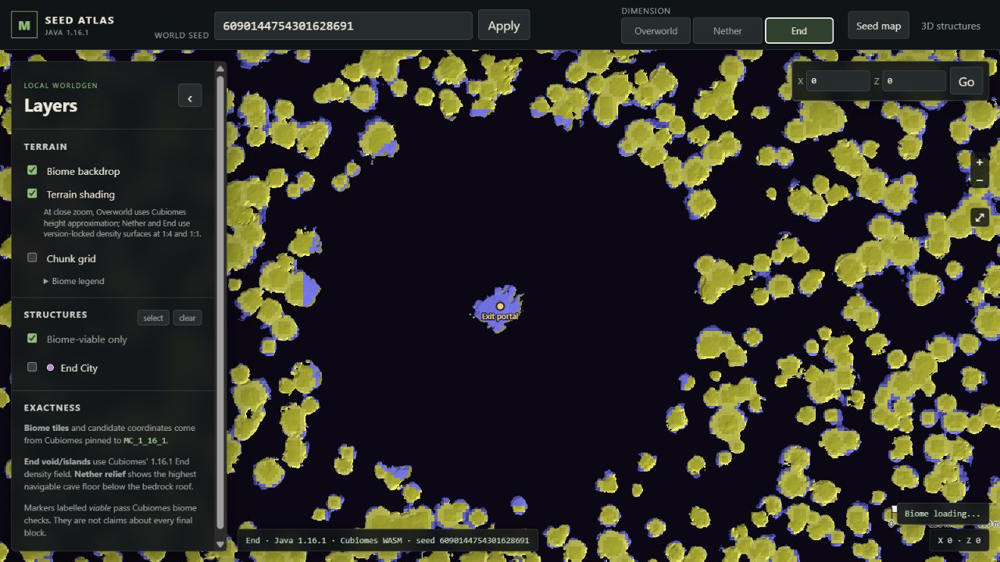
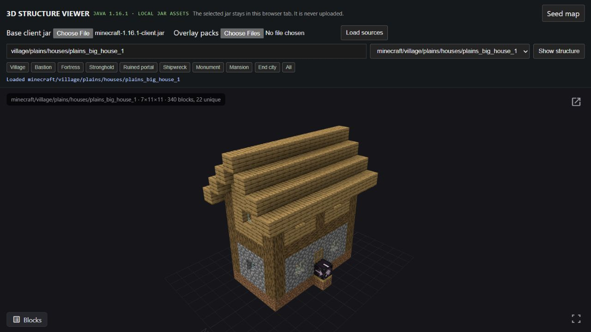

# Local Java 1.16.1 interactive viewers

This directory adds two mouse-interactive, browser-based tools to the project:

- **Seed Atlas** — pan and zoom through Cubiomes biome output, optional
  `mapApproxHeight` terrain shading, a chunk grid, dimension switching, and
  structure candidate overlays.
- **3D Structure Viewer** — load the local Minecraft 1.16.1 client JAR, search
  its structure templates, and orbit, zoom, inspect, or walk through rendered
  structures.

Both tools run locally. After the JavaScript dependencies are installed, the
browser runtime makes no request to either reference site. The selected JAR
stays in the browser tab and is not uploaded.

GitHub Pages builds the same static bundle at:

- `https://isolatedsingularity.github.io/Minecraft-Generation/seed-map.html`
- `https://isolatedsingularity.github.io/Minecraft-Generation/local-loader.html`





## Start the viewers

From the repository root in PowerShell:

```powershell
.\Viewer\start.ps1
```

The script installs the Viewer dependencies the first time and then starts the
local Vite server. Open:

- `http://127.0.0.1:5173/seed-map.html`
- `http://127.0.0.1:5173/local-loader.html`

For the 3D viewer, choose:

```text
Game Reference\01_upstream\minecraft-1.16.1-client.jar
```

Then select **Load sources**. The filter buttons expose the main families,
including villages, bastions, Nether fortresses, strongholds, ruined portals,
shipwrecks, monuments, mansions, and End cities. The client JAR contains 866
canonical 1.16.1 NBT templates. A minimal 43-file source-checked bundle restores
the fortress and stronghold piece templates and masks that Mojang's client JAR
does not ship as standalone resources.

You can also start the server manually:

```powershell
cd Viewer
npm install
npm run dev -- --host 127.0.0.1
```

## Controls

### Seed Atlas

- Drag to pan; use the wheel or `+`/`-` to zoom.
- Enter any signed Java `long` seed and select **Apply**.
- Switch between Overworld, Nether, and End.
- Toggle biome tiles, terrain shading, the chunk grid, viability filtering, and
  individual structure families.
- Hover the map to inspect the exact biome ID and open the biome legend to see
  Cubiomes' full palette, including distinct dark and deep ocean colors.
- Enter exact X/Z coordinates and select **Go**.
- The URL fragment records seed, center, zoom, dimension, and active layers so
  a view can be copied or bookmarked.

### 3D structures

- Drag with the primary mouse button to orbit; wheel to zoom; secondary drag to
  pan.
- Search for a template or use a structure-family button, then choose **Show
  structure**.
- For procedural fortress, stronghold, village, mansion, and End City entries,
  use the viewer's **Level** and **Re-roll** controls to grow and regenerate the
  multi-piece assembly. The bundled fortress and stronghold piece rules are the
  families specifically checked against the local 1.16.1 Java sources.
- Use **Blocks** to inspect block counts and the expand icon for fullscreen.
- The full viewer also retains first-person walk and local-file workflows.

## Accuracy boundary

The seed map compiles the vendored Cubiomes C implementation with the generator
pinned to `MC_1_16_1`. Biome tiles, approximate surface-height shading,
random-spread candidates, viability checks, Nether fortress/bastion splitting,
and all 128 stronghold candidates are calculated locally from the entered seed.

Structure markers identify candidate chunks and optionally pass Cubiomes biome
viability; they do not claim every final block survives terrain, neighboring
features, or later world-generation checks. Terrain shading is Cubiomes'
approximate height map, not a rendered world save.

Raw NBT templates loaded from the 1.16.1 client JAR are version-exact. A
multi-piece reference assembly is useful for understanding a large family, but
it is not a claim that a particular world seed produces that exact arrangement.
For block-for-block proof of a generated instance, load the corresponding world
save or structure export in the full viewer.

## Build and verify

The prebuilt WebAssembly files are committed, so ordinary users do not need
Python, a compiler, or Emscripten. Rebuilding them is optional:

```powershell
cd Viewer
npm run test:builtins
npm run build:wasm
npm run test:wasm
npm run build
npm audit --audit-level=moderate
```

`build:wasm` and `test:wasm` look for emsdk under `.oracle-bin/emsdk`, through
`EMSDK`, or on `PATH`. The production build is written to ignored `Viewer/dist`.

## Implementation and provenance

- `src/seed-map/` contains the OpenLayers UI and Web Worker.
- `cubiomes/mc1161_wasm.c` is the narrow C-to-WebAssembly interface.
- `vendor/cubiomes/` is pinned to Cubiomes commit
  `e61f90580cbdd883214a8054670dacae655e59c0`; its MIT license is preserved.
- The Vue/Three structure application is based on the local reference snapshot
  at commit `cd129759973d893fad6a6663780907ca58a31a52`.
- `src/assets/minecraft-1.16.1-builtins.zip` contains only the 13 fortress NBT
  pieces and 15 stronghold NBT pieces plus their 15 random-block masks. The
  generator piece weights, caps, depth/radius rules, and block IDs were checked
  against the local Minecraft Java 1.16.1 source corpus. Rebuild it from the
  local reference snapshot with `npm run build:builtins`.
- `vendor/block-model-renderer/` contains the local browser renderer and its
  preserved license. No CDN module or hosted asset is required at runtime.

The client JAR remains in the private, gitignored `Game Reference/` corpus. Do
not stage or commit it. GitHub Pages never hosts that JAR; the user explicitly
chooses it in their own browser tab.
